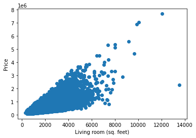

# Home Dataset:

- Link: [Github Repository](https://github.com/rashida048/Datasets/blob/master/home_data.csv)
- Purpose: I would use this dataset for predicting house price using linear regression.

## Credit Card Dataset:

- Link: [Kaggle Dataset](https://www.kaggle.com/mlg-ulb/creditcardfraud)
- Purpose: I would use this dataset for credit card fraud detection system.

## Movie Dataset:

- Link: [Github Repository](https://github.com/rashida048/Datasets/blob/master/movie_dataset.csv)
- Purpose: I would use this dataset for making movie recommendation system.

## Heart Disease Dataset:

- Link: [Kaggle Dataset](https://www.kaggle.com/johnsmith88/heart-disease-dataset)
- Purpose: This dataset can be used for predicting probability of heart diseasev in a person.

## Natural Image Dataset:


- Link: [Kaggle Dataset](https://www.kaggle.com/prasunroy/natural-images)
- Purpose: I would use this dataset for image detection. It can be a good practice for multiclass classification.

# Dataset information


## Chosen dataset: ***Home Dataset***


```python
import matplotlib
import numpy as np
import pandas as pd
import matplotlib.pyplot as plt
```


```python
data= pd.read_csv("home_data.csv")
```


```python
data.head(10)
```


<div>
<style scoped>
    .dataframe tbody tr th:only-of-type {
        vertical-align: middle;
    }

    .dataframe tbody tr th {
        vertical-align: top;
    }

    .dataframe thead th {
        text-align: right;
    }
</style>
<table border="1" class="dataframe">
  <thead>
    <tr style="text-align: right;">
      <th></th>
      <th>id</th>
      <th>date</th>
      <th>price</th>
      <th>bedrooms</th>
      <th>bathrooms</th>
      <th>sqft_living</th>
      <th>sqft_lot</th>
      <th>floors</th>
      <th>waterfront</th>
      <th>view</th>
      <th>...</th>
      <th>grade</th>
      <th>sqft_above</th>
      <th>sqft_basement</th>
      <th>yr_built</th>
      <th>yr_renovated</th>
      <th>zipcode</th>
      <th>lat</th>
      <th>long</th>
      <th>sqft_living15</th>
      <th>sqft_lot15</th>
    </tr>
  </thead>
  <tbody>
    <tr>
      <th>0</th>
      <td>7129300520</td>
      <td>20141013T000000</td>
      <td>221900</td>
      <td>3</td>
      <td>1.00</td>
      <td>1180</td>
      <td>5650</td>
      <td>1.0</td>
      <td>0</td>
      <td>0</td>
      <td>...</td>
      <td>7</td>
      <td>1180</td>
      <td>0</td>
      <td>1955</td>
      <td>0</td>
      <td>98178</td>
      <td>47.5112</td>
      <td>-122.257</td>
      <td>1340</td>
      <td>5650</td>
    </tr>
    <tr>
      <th>1</th>
      <td>6414100192</td>
      <td>20141209T000000</td>
      <td>538000</td>
      <td>3</td>
      <td>2.25</td>
      <td>2570</td>
      <td>7242</td>
      <td>2.0</td>
      <td>0</td>
      <td>0</td>
      <td>...</td>
      <td>7</td>
      <td>2170</td>
      <td>400</td>
      <td>1951</td>
      <td>1991</td>
      <td>98125</td>
      <td>47.7210</td>
      <td>-122.319</td>
      <td>1690</td>
      <td>7639</td>
    </tr>
    <tr>
      <th>2</th>
      <td>5631500400</td>
      <td>20150225T000000</td>
      <td>180000</td>
      <td>2</td>
      <td>1.00</td>
      <td>770</td>
      <td>10000</td>
      <td>1.0</td>
      <td>0</td>
      <td>0</td>
      <td>...</td>
      <td>6</td>
      <td>770</td>
      <td>0</td>
      <td>1933</td>
      <td>0</td>
      <td>98028</td>
      <td>47.7379</td>
      <td>-122.233</td>
      <td>2720</td>
      <td>8062</td>
    </tr>
    <tr>
      <th>3</th>
      <td>2487200875</td>
      <td>20141209T000000</td>
      <td>604000</td>
      <td>4</td>
      <td>3.00</td>
      <td>1960</td>
      <td>5000</td>
      <td>1.0</td>
      <td>0</td>
      <td>0</td>
      <td>...</td>
      <td>7</td>
      <td>1050</td>
      <td>910</td>
      <td>1965</td>
      <td>0</td>
      <td>98136</td>
      <td>47.5208</td>
      <td>-122.393</td>
      <td>1360</td>
      <td>5000</td>
    </tr>
    <tr>
      <th>4</th>
      <td>1954400510</td>
      <td>20150218T000000</td>
      <td>510000</td>
      <td>3</td>
      <td>2.00</td>
      <td>1680</td>
      <td>8080</td>
      <td>1.0</td>
      <td>0</td>
      <td>0</td>
      <td>...</td>
      <td>8</td>
      <td>1680</td>
      <td>0</td>
      <td>1987</td>
      <td>0</td>
      <td>98074</td>
      <td>47.6168</td>
      <td>-122.045</td>
      <td>1800</td>
      <td>7503</td>
    </tr>
    <tr>
      <th>5</th>
      <td>7237550310</td>
      <td>20140512T000000</td>
      <td>1225000</td>
      <td>4</td>
      <td>4.50</td>
      <td>5420</td>
      <td>101930</td>
      <td>1.0</td>
      <td>0</td>
      <td>0</td>
      <td>...</td>
      <td>11</td>
      <td>3890</td>
      <td>1530</td>
      <td>2001</td>
      <td>0</td>
      <td>98053</td>
      <td>47.6561</td>
      <td>-122.005</td>
      <td>4760</td>
      <td>101930</td>
    </tr>
    <tr>
      <th>6</th>
      <td>1321400060</td>
      <td>20140627T000000</td>
      <td>257500</td>
      <td>3</td>
      <td>2.25</td>
      <td>1715</td>
      <td>6819</td>
      <td>2.0</td>
      <td>0</td>
      <td>0</td>
      <td>...</td>
      <td>7</td>
      <td>1715</td>
      <td>0</td>
      <td>1995</td>
      <td>0</td>
      <td>98003</td>
      <td>47.3097</td>
      <td>-122.327</td>
      <td>2238</td>
      <td>6819</td>
    </tr>
    <tr>
      <th>7</th>
      <td>2008000270</td>
      <td>20150115T000000</td>
      <td>291850</td>
      <td>3</td>
      <td>1.50</td>
      <td>1060</td>
      <td>9711</td>
      <td>1.0</td>
      <td>0</td>
      <td>0</td>
      <td>...</td>
      <td>7</td>
      <td>1060</td>
      <td>0</td>
      <td>1963</td>
      <td>0</td>
      <td>98198</td>
      <td>47.4095</td>
      <td>-122.315</td>
      <td>1650</td>
      <td>9711</td>
    </tr>
    <tr>
      <th>8</th>
      <td>2414600126</td>
      <td>20150415T000000</td>
      <td>229500</td>
      <td>3</td>
      <td>1.00</td>
      <td>1780</td>
      <td>7470</td>
      <td>1.0</td>
      <td>0</td>
      <td>0</td>
      <td>...</td>
      <td>7</td>
      <td>1050</td>
      <td>730</td>
      <td>1960</td>
      <td>0</td>
      <td>98146</td>
      <td>47.5123</td>
      <td>-122.337</td>
      <td>1780</td>
      <td>8113</td>
    </tr>
    <tr>
      <th>9</th>
      <td>3793500160</td>
      <td>20150312T000000</td>
      <td>323000</td>
      <td>3</td>
      <td>2.50</td>
      <td>1890</td>
      <td>6560</td>
      <td>2.0</td>
      <td>0</td>
      <td>0</td>
      <td>...</td>
      <td>7</td>
      <td>1890</td>
      <td>0</td>
      <td>2003</td>
      <td>0</td>
      <td>98038</td>
      <td>47.3684</td>
      <td>-122.031</td>
      <td>2390</td>
      <td>7570</td>
    </tr>
  </tbody>
</table>
<p>10 rows × 21 columns</p>
</div>


```python
pd.set_option("display.max.columns",None)
data.tail()
```


<div>
<style scoped>
    .dataframe tbody tr th:only-of-type {
        vertical-align: middle;
    }

    .dataframe tbody tr th {
        vertical-align: top;
    }

    .dataframe thead th {
        text-align: right;
    }
</style>
<table border="1" class="dataframe">
  <thead>
    <tr style="text-align: right;">
      <th></th>
      <th>id</th>
      <th>date</th>
      <th>price</th>
      <th>bedrooms</th>
      <th>bathrooms</th>
      <th>sqft_living</th>
      <th>sqft_lot</th>
      <th>floors</th>
      <th>waterfront</th>
      <th>view</th>
      <th>condition</th>
      <th>grade</th>
      <th>sqft_above</th>
      <th>sqft_basement</th>
      <th>yr_built</th>
      <th>yr_renovated</th>
      <th>zipcode</th>
      <th>lat</th>
      <th>long</th>
      <th>sqft_living15</th>
      <th>sqft_lot15</th>
    </tr>
  </thead>
  <tbody>
    <tr>
      <th>21608</th>
      <td>263000018</td>
      <td>20140521T000000</td>
      <td>360000</td>
      <td>3</td>
      <td>2.50</td>
      <td>1530</td>
      <td>1131</td>
      <td>3.0</td>
      <td>0</td>
      <td>0</td>
      <td>3</td>
      <td>8</td>
      <td>1530</td>
      <td>0</td>
      <td>2009</td>
      <td>0</td>
      <td>98103</td>
      <td>47.6993</td>
      <td>-122.346</td>
      <td>1530</td>
      <td>1509</td>
    </tr>
    <tr>
      <th>21609</th>
      <td>6600060120</td>
      <td>20150223T000000</td>
      <td>400000</td>
      <td>4</td>
      <td>2.50</td>
      <td>2310</td>
      <td>5813</td>
      <td>2.0</td>
      <td>0</td>
      <td>0</td>
      <td>3</td>
      <td>8</td>
      <td>2310</td>
      <td>0</td>
      <td>2014</td>
      <td>0</td>
      <td>98146</td>
      <td>47.5107</td>
      <td>-122.362</td>
      <td>1830</td>
      <td>7200</td>
    </tr>
    <tr>
      <th>21610</th>
      <td>1523300141</td>
      <td>20140623T000000</td>
      <td>402101</td>
      <td>2</td>
      <td>0.75</td>
      <td>1020</td>
      <td>1350</td>
      <td>2.0</td>
      <td>0</td>
      <td>0</td>
      <td>3</td>
      <td>7</td>
      <td>1020</td>
      <td>0</td>
      <td>2009</td>
      <td>0</td>
      <td>98144</td>
      <td>47.5944</td>
      <td>-122.299</td>
      <td>1020</td>
      <td>2007</td>
    </tr>
    <tr>
      <th>21611</th>
      <td>291310100</td>
      <td>20150116T000000</td>
      <td>400000</td>
      <td>3</td>
      <td>2.50</td>
      <td>1600</td>
      <td>2388</td>
      <td>2.0</td>
      <td>0</td>
      <td>0</td>
      <td>3</td>
      <td>8</td>
      <td>1600</td>
      <td>0</td>
      <td>2004</td>
      <td>0</td>
      <td>98027</td>
      <td>47.5345</td>
      <td>-122.069</td>
      <td>1410</td>
      <td>1287</td>
    </tr>
    <tr>
      <th>21612</th>
      <td>1523300157</td>
      <td>20141015T000000</td>
      <td>325000</td>
      <td>2</td>
      <td>0.75</td>
      <td>1020</td>
      <td>1076</td>
      <td>2.0</td>
      <td>0</td>
      <td>0</td>
      <td>3</td>
      <td>7</td>
      <td>1020</td>
      <td>0</td>
      <td>2008</td>
      <td>0</td>
      <td>98144</td>
      <td>47.5941</td>
      <td>-122.299</td>
      <td>1020</td>
      <td>1357</td>
    </tr>
  </tbody>
</table>
</div>


```python
data.dtypes
```


    id                 int64
    date              object
    price              int64
    bedrooms           int64
    bathrooms        float64
    sqft_living        int64
    sqft_lot           int64
    floors           float64
    waterfront         int64
    view               int64
    condition          int64
    grade              int64
    sqft_above         int64
    sqft_basement      int64
    yr_built           int64
    yr_renovated       int64
    zipcode            int64
    lat              float64
    long             float64
    sqft_living15      int64
    sqft_lot15         int64
    dtype: object


```python
data.describe()
```


<div>
<style scoped>
    .dataframe tbody tr th:only-of-type {
        vertical-align: middle;
    }

    .dataframe tbody tr th {
        vertical-align: top;
    }

    .dataframe thead th {
        text-align: right;
    }
</style>
<table border="1" class="dataframe">
  <thead>
    <tr style="text-align: right;">
      <th></th>
      <th>id</th>
      <th>price</th>
      <th>bedrooms</th>
      <th>bathrooms</th>
      <th>sqft_living</th>
      <th>sqft_lot</th>
      <th>floors</th>
      <th>waterfront</th>
      <th>view</th>
      <th>condition</th>
      <th>grade</th>
      <th>sqft_above</th>
      <th>sqft_basement</th>
      <th>yr_built</th>
      <th>yr_renovated</th>
      <th>zipcode</th>
      <th>lat</th>
      <th>long</th>
      <th>sqft_living15</th>
      <th>sqft_lot15</th>
    </tr>
  </thead>
  <tbody>
    <tr>
      <th>count</th>
      <td>2.161300e+04</td>
      <td>2.161300e+04</td>
      <td>21613.000000</td>
      <td>21613.000000</td>
      <td>21613.000000</td>
      <td>2.161300e+04</td>
      <td>21613.000000</td>
      <td>21613.000000</td>
      <td>21613.000000</td>
      <td>21613.000000</td>
      <td>21613.000000</td>
      <td>21613.000000</td>
      <td>21613.000000</td>
      <td>21613.000000</td>
      <td>21613.000000</td>
      <td>21613.000000</td>
      <td>21613.000000</td>
      <td>21613.000000</td>
      <td>21613.000000</td>
      <td>21613.000000</td>
    </tr>
    <tr>
      <th>mean</th>
      <td>4.580302e+09</td>
      <td>5.400881e+05</td>
      <td>3.370842</td>
      <td>2.114757</td>
      <td>2079.899736</td>
      <td>1.510697e+04</td>
      <td>1.494309</td>
      <td>0.007542</td>
      <td>0.234303</td>
      <td>3.409430</td>
      <td>7.656873</td>
      <td>1788.390691</td>
      <td>291.509045</td>
      <td>1971.005136</td>
      <td>84.402258</td>
      <td>98077.939805</td>
      <td>47.560053</td>
      <td>-122.213896</td>
      <td>1986.552492</td>
      <td>12768.455652</td>
    </tr>
    <tr>
      <th>std</th>
      <td>2.876566e+09</td>
      <td>3.671272e+05</td>
      <td>0.930062</td>
      <td>0.770163</td>
      <td>918.440897</td>
      <td>4.142051e+04</td>
      <td>0.539989</td>
      <td>0.086517</td>
      <td>0.766318</td>
      <td>0.650743</td>
      <td>1.175459</td>
      <td>828.090978</td>
      <td>442.575043</td>
      <td>29.373411</td>
      <td>401.679240</td>
      <td>53.505026</td>
      <td>0.138564</td>
      <td>0.140828</td>
      <td>685.391304</td>
      <td>27304.179631</td>
    </tr>
    <tr>
      <th>min</th>
      <td>1.000102e+06</td>
      <td>7.500000e+04</td>
      <td>0.000000</td>
      <td>0.000000</td>
      <td>290.000000</td>
      <td>5.200000e+02</td>
      <td>1.000000</td>
      <td>0.000000</td>
      <td>0.000000</td>
      <td>1.000000</td>
      <td>1.000000</td>
      <td>290.000000</td>
      <td>0.000000</td>
      <td>1900.000000</td>
      <td>0.000000</td>
      <td>98001.000000</td>
      <td>47.155900</td>
      <td>-122.519000</td>
      <td>399.000000</td>
      <td>651.000000</td>
    </tr>
    <tr>
      <th>25%</th>
      <td>2.123049e+09</td>
      <td>3.219500e+05</td>
      <td>3.000000</td>
      <td>1.750000</td>
      <td>1427.000000</td>
      <td>5.040000e+03</td>
      <td>1.000000</td>
      <td>0.000000</td>
      <td>0.000000</td>
      <td>3.000000</td>
      <td>7.000000</td>
      <td>1190.000000</td>
      <td>0.000000</td>
      <td>1951.000000</td>
      <td>0.000000</td>
      <td>98033.000000</td>
      <td>47.471000</td>
      <td>-122.328000</td>
      <td>1490.000000</td>
      <td>5100.000000</td>
    </tr>
    <tr>
      <th>50%</th>
      <td>3.904930e+09</td>
      <td>4.500000e+05</td>
      <td>3.000000</td>
      <td>2.250000</td>
      <td>1910.000000</td>
      <td>7.618000e+03</td>
      <td>1.500000</td>
      <td>0.000000</td>
      <td>0.000000</td>
      <td>3.000000</td>
      <td>7.000000</td>
      <td>1560.000000</td>
      <td>0.000000</td>
      <td>1975.000000</td>
      <td>0.000000</td>
      <td>98065.000000</td>
      <td>47.571800</td>
      <td>-122.230000</td>
      <td>1840.000000</td>
      <td>7620.000000</td>
    </tr>
    <tr>
      <th>75%</th>
      <td>7.308900e+09</td>
      <td>6.450000e+05</td>
      <td>4.000000</td>
      <td>2.500000</td>
      <td>2550.000000</td>
      <td>1.068800e+04</td>
      <td>2.000000</td>
      <td>0.000000</td>
      <td>0.000000</td>
      <td>4.000000</td>
      <td>8.000000</td>
      <td>2210.000000</td>
      <td>560.000000</td>
      <td>1997.000000</td>
      <td>0.000000</td>
      <td>98118.000000</td>
      <td>47.678000</td>
      <td>-122.125000</td>
      <td>2360.000000</td>
      <td>10083.000000</td>
    </tr>
    <tr>
      <th>max</th>
      <td>9.900000e+09</td>
      <td>7.700000e+06</td>
      <td>33.000000</td>
      <td>8.000000</td>
      <td>13540.000000</td>
      <td>1.651359e+06</td>
      <td>3.500000</td>
      <td>1.000000</td>
      <td>4.000000</td>
      <td>5.000000</td>
      <td>13.000000</td>
      <td>9410.000000</td>
      <td>4820.000000</td>
      <td>2015.000000</td>
      <td>2015.000000</td>
      <td>98199.000000</td>
      <td>47.777600</td>
      <td>-121.315000</td>
      <td>6210.000000</td>
      <td>871200.000000</td>
    </tr>
  </tbody>
</table>
</div>


```python
date = data.iloc[:,1]
date = [item[:8] for item in date]
date[:5]
```


    ['20141013', '20141209', '20150225', '20141209', '20150218']


```python
from datetime import datetime
newDate= [datetime.strptime(item,"%Y%m%d") for item in date]
newDate[:5]
```


    [datetime.datetime(2014, 10, 13, 0, 0),
     datetime.datetime(2014, 12, 9, 0, 0),
     datetime.datetime(2015, 2, 25, 0, 0),
     datetime.datetime(2014, 12, 9, 0, 0),
     datetime.datetime(2015, 2, 18, 0, 0)]


```python
data['date']=newDate
data.head()
```


<div>
<style scoped>
    .dataframe tbody tr th:only-of-type {
        vertical-align: middle;
    }

    .dataframe tbody tr th {
        vertical-align: top;
    }

    .dataframe thead th {
        text-align: right;
    }
</style>
<table border="1" class="dataframe">
  <thead>
    <tr style="text-align: right;">
      <th></th>
      <th>id</th>
      <th>date</th>
      <th>price</th>
      <th>bedrooms</th>
      <th>bathrooms</th>
      <th>sqft_living</th>
      <th>sqft_lot</th>
      <th>floors</th>
      <th>waterfront</th>
      <th>view</th>
      <th>condition</th>
      <th>grade</th>
      <th>sqft_above</th>
      <th>sqft_basement</th>
      <th>yr_built</th>
      <th>yr_renovated</th>
      <th>zipcode</th>
      <th>lat</th>
      <th>long</th>
      <th>sqft_living15</th>
      <th>sqft_lot15</th>
    </tr>
  </thead>
  <tbody>
    <tr>
      <th>0</th>
      <td>7129300520</td>
      <td>2014-10-13</td>
      <td>221900</td>
      <td>3</td>
      <td>1.00</td>
      <td>1180</td>
      <td>5650</td>
      <td>1.0</td>
      <td>0</td>
      <td>0</td>
      <td>3</td>
      <td>7</td>
      <td>1180</td>
      <td>0</td>
      <td>1955</td>
      <td>0</td>
      <td>98178</td>
      <td>47.5112</td>
      <td>-122.257</td>
      <td>1340</td>
      <td>5650</td>
    </tr>
    <tr>
      <th>1</th>
      <td>6414100192</td>
      <td>2014-12-09</td>
      <td>538000</td>
      <td>3</td>
      <td>2.25</td>
      <td>2570</td>
      <td>7242</td>
      <td>2.0</td>
      <td>0</td>
      <td>0</td>
      <td>3</td>
      <td>7</td>
      <td>2170</td>
      <td>400</td>
      <td>1951</td>
      <td>1991</td>
      <td>98125</td>
      <td>47.7210</td>
      <td>-122.319</td>
      <td>1690</td>
      <td>7639</td>
    </tr>
    <tr>
      <th>2</th>
      <td>5631500400</td>
      <td>2015-02-25</td>
      <td>180000</td>
      <td>2</td>
      <td>1.00</td>
      <td>770</td>
      <td>10000</td>
      <td>1.0</td>
      <td>0</td>
      <td>0</td>
      <td>3</td>
      <td>6</td>
      <td>770</td>
      <td>0</td>
      <td>1933</td>
      <td>0</td>
      <td>98028</td>
      <td>47.7379</td>
      <td>-122.233</td>
      <td>2720</td>
      <td>8062</td>
    </tr>
    <tr>
      <th>3</th>
      <td>2487200875</td>
      <td>2014-12-09</td>
      <td>604000</td>
      <td>4</td>
      <td>3.00</td>
      <td>1960</td>
      <td>5000</td>
      <td>1.0</td>
      <td>0</td>
      <td>0</td>
      <td>5</td>
      <td>7</td>
      <td>1050</td>
      <td>910</td>
      <td>1965</td>
      <td>0</td>
      <td>98136</td>
      <td>47.5208</td>
      <td>-122.393</td>
      <td>1360</td>
      <td>5000</td>
    </tr>
    <tr>
      <th>4</th>
      <td>1954400510</td>
      <td>2015-02-18</td>
      <td>510000</td>
      <td>3</td>
      <td>2.00</td>
      <td>1680</td>
      <td>8080</td>
      <td>1.0</td>
      <td>0</td>
      <td>0</td>
      <td>3</td>
      <td>8</td>
      <td>1680</td>
      <td>0</td>
      <td>1987</td>
      <td>0</td>
      <td>98074</td>
      <td>47.6168</td>
      <td>-122.045</td>
      <td>1800</td>
      <td>7503</td>
    </tr>
  </tbody>
</table>
</div>


```python
X = data['sqft_living'].values.reshape(-1,1)
Y = data.iloc[:,2].values.reshape(-1,1)
```


```python
plt.scatter(X,Y)
plt.xlabel("Living room (sq. feet)")
plt.ylabel("Price")

plt.show()
```





```python

```
